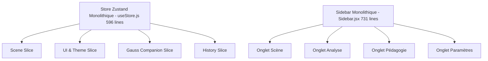
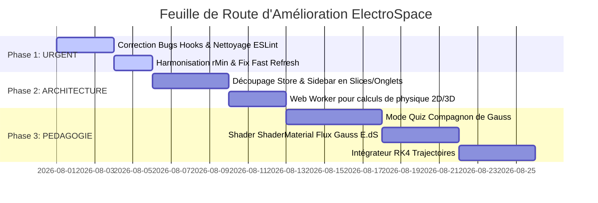

# 📊 Audit Complet & Plan d'Améliorations — ElectroSpace

> **Application** : ElectroSpace (Simulateur 3D d'Électrostatique Pédagogique)  
> **Date de l'audit** : 29 Juillet 2026  
> **Auteur** : Antigravity (AI Software Engineering Review)  
> **Fichier généré à la racine** : `AUDIT_COMPLET_ELECTROSPACE.md`

---

## 📋 Sommaire

1. [Résumé Exécutif](#1-résumé-exécutif)
2. [Code Mort : Fonctions, Constantes et Variables Inutilisées](#2-code-mort--fonctions-constantes-et-variables-inutilisées)
3. [Audit des Bugs Critiques et Violations React](#3-audit-des-bugs-critiques-et-violations-react)
4. [Inconsistances de Code, de Physique et d'Architecture](#4-inconsistances-de-code-de-physique-et-darchitecture)
5. [Propositions d'Améliorations Fonctionnelles & Pédagogiques](#5-propositions-daméliorations-fonctionnelles--pédagogiques)
6. [Propositions d'Améliorations Techniques & Performance](#6-propositions-daméliorations-techniques--performance)
7. [Feuille de Route d'Implémentation (Roadmap)](#7-feuille-de-route-dimplémentation-roadmap)

---

## 1. 📌 Résumé Exécutif

L'application **ElectroSpace** est une plateforme web interactive remarquable permettant de visualiser des champs électrostatiques, des potentiels et des surfaces de Gauss en 3D (`Three.js` / `@react-three/fiber`), gérée via `Zustand`, `Vite` et `React 19`.

### État de Santé Actuel du Projet

| Métrique | État | Détails |
| :--- | :---: | :--- |
| **Tests Unitaires (Vitest)** | ✅ **PASSING** | 90 tests validés sur 90 (`gauss.test.js` & `utils.test.js`) |
| **Build Vite** | ✅ **OK** | Compilation fonctionnelle via `vite build` |
| **Linter ESLint** | ❌ **FAIL** | **46 problèmes** (38 erreurs bloquantes, 8 avertissements) |
| **Qualité React / Hooks** | ⚠️ **RISQUE** | Plusieurs violations strictes des règles des Hooks React (set-state dans effect, refs lues/écrites pendant le rendu) |
| **Architecture Store & UI** | 🟠 **MONOLITHIQUE** | `useStore.js` (596 lignes) et `Sidebar.jsx` (731 lignes) sont surchargés |

> [!IMPORTANT]
> **Consigne respectée** : Aucun fichier de code n'a été modifié ou exécuté dans le cadre de cet audit. Ce document constitue le rapport final exhaustif déposé à la racine du projet.

---

## 2. 🧹 Code Mort : Fonctions, Constantes et Variables Inutilisées

Une analyse statique approfondie combinée avec l'audit ESLint révèle **30+ éléments inutilisés** à travers le projet.

### 2.1 Tableau Récapitulatif du Code Mort

| Fichier | Symbole Inutilisé | Type | Ligne(s) | Description / Impact |
| :--- | :--- | :--- | :---: | :--- |
| [physics/constants.js](file:///c:/wamp64/www/electrospace/src/physics/constants.js#L14) | `E_FIELD_GRID_SIZE` | Constante | L14 | Exportée mais jamais importée ni utilisée. |
| [physics/coulomb.js](file:///c:/wamp64/www/electrospace/src/physics/coulomb.js#L901) | `len` | Variable | L901 | Assignée dans la boucle de la distribution rectangle mais inutilisée. |
| [store/useStore.js](file:///c:/wamp64/www/electrospace/src/store/useStore.js#L261) | `_id` | Variable/Paramètre | L261 | Déstructurée lors de l'export de scène mais non lue. |
| [store/useStore.js](file:///c:/wamp64/www/electrospace/src/store/useStore.js#L418) | `_` | Variable | L418 | Variable d'omission rest non lue. |
| [store/useStore.js](file:///c:/wamp64/www/electrospace/src/store/useStore.js#L462) | `state` | Paramètre | L462 | Callback `set((state) => ...)` n'utilisant pas `state`. |
| [components/Sidebar.jsx](file:///c:/wamp64/www/electrospace/src/components/Sidebar.jsx#L1) | `__GIT_VERSION__` | Import / Constante | L1 | Importée/définie sans être rendue dans le JSX. |
| [components/Sidebar.jsx](file:///c:/wamp64/www/electrospace/src/components/Sidebar.jsx#L5) | `TextWithMath` | Composant | L5 | Importé depuis `math.jsx` mais inutilisé. |
| [components/Sidebar.jsx](file:///c:/wamp64/www/electrospace/src/components/Sidebar.jsx#L399) | `charges` | Variable | L399 | Assignée localement sans lecture. |
| [components/ChargeTrajectory.jsx](file:///c:/wamp64/www/electrospace/src/components/ChargeTrajectory.jsx#L13) | `seededRef` | Ref React | L13 | Instanciée avec `useRef` mais jamais exploitée. |
| [components/FieldGraph.jsx](file:///c:/wamp64/www/electrospace/src/components/FieldGraph.jsx#L170) | `cursorPosRef` | Ref React | L170 | Variable ref inutilisée. |
| [components/FieldGraph.jsx](file:///c:/wamp64/www/electrospace/src/components/FieldGraph.jsx#L383) | `err` (catch) | Paramètre d'erreur | L383, L407, L426 | Catch d'exception sans utilisation du paramètre. |
| [components/GaussWizard.jsx](file:///c:/wamp64/www/electrospace/src/components/GaussWizard.jsx#L126) | `gaussSurfaceRadius` | State | L126, L129, L132-136 | Variables de dimensions de surface extraites du store mais inutilisées. |
| [components/GaussWizard.jsx](file:///c:/wamp64/www/electrospace/src/components/GaussWizard.jsx#L175) | `charges` | State | L175 | Extraite du store mais non référencée dans le composant. |
| [components/PhysicsCanvas.jsx](file:///c:/wamp64/www/electrospace/src/components/PhysicsCanvas.jsx#L54) | `_rootRef` | Prop / Variable | L54 | Reçue en prop mais ignorée. |
| [components/PotentialXGraph.jsx](file:///c:/wamp64/www/electrospace/src/components/PotentialXGraph.jsx#L1) | `useMemo` | Import React | L1 | Importé dans le header du fichier mais jamais appelé. |

---

## 3. 🚨 Audit des Bugs Critiques et Violations React

### 3.1 Violations des Règles des React Hooks

#### A. Accès prématuré aux fonctions non hissées (`scheduleWindowRaf`)
- **Fichiers** : [FieldGraph.jsx](file:///c:/wamp64/www/electrospace/src/components/FieldGraph.jsx#L341) et [PotentialXGraph.jsx](file:///c:/wamp64/www/electrospace/src/components/PotentialXGraph.jsx#L329)
- **Problème** : `scheduleWindowRaf` est déclarée plus bas sous forme de `const scheduleWindowRaf = useCallback(...)`. Son appel dans l'effet au-dessus provoque une erreur d'accès avant initialisation.
- **Solution** : Déplacer la déclaration de `scheduleWindowRaf` au-dessus de son premier emploi dans le composant.

#### B. Modication de `ref.current` pendant le rendu ou dans `useFrame`
- **Fichier** : [PhysicsCanvas.jsx](file:///c:/wamp64/www/electrospace/src/components/PhysicsCanvas.jsx#L45)
- **Problème** : Réassignation directe `animationTarget.current = null` dans le callback `useFrame`. React 19 et les linters modernes détectent cela comme une mutation illégale de props/arguments de hook.
- **Solution** : Gérer la fin d'animation via un état local ou une notification d'effet propre.

#### C. Invocations synchrones de `setState` à l'intérieur d'un `useEffect`
- **Fichiers** : [FieldGraph.jsx](file:///c:/wamp64/www/electrospace/src/components/FieldGraph.jsx#L173), [PotentialXGraph.jsx](file:///c:/wamp64/www/electrospace/src/components/PotentialXGraph.jsx#L161), [GaussWizard.jsx](file:///c:/wamp64/www/electrospace/src/components/GaussWizard.jsx#L167)
- **Problème** : Des réinitialisations d'état synchrone (ex: `if (!show) { setData(null); return }`) sont exécutées directement au sommet d'effets, provoquant des rendus en cascade (*cascading re-renders*) néfastes pour les performances 60fps.
- **Solution** : Dériver la donnée pendant le rendu ou déplacer la mise à jour d'état dans les handlers d'événements.

#### D. Lecture du Store hors de la réactivité React dans `useMemo`
- **Fichier** : [Equipotentials3D.jsx](file:///c:/wamp64/www/electrospace/src/components/Equipotentials3D.jsx#L31)
- **Problème** : `const { ke, rMin } = useStore.getState()` est appelé de manière impérative à l'intérieur du bloc `useMemo`. Si l'utilisateur modifie la constante de Coulomb `ke` ou le rayon d'arrêt `rMin`, la surface 3D ne se recalculera pas car ces variables ne sont pas dans le tableau de dépendances.
- **Solution** : S'abonner aux valeurs du store via `useStore((state) => state.ke)` et les ajouter aux dépendances du `useMemo`.

#### E. Mauvaise capture de Ref dans le Cleanup d'un `useEffect`
- **Fichier** : [ChargeTrajectory.jsx](file:///c:/wamp64/www/electrospace/src/components/ChargeTrajectory.jsx#L17)
- **Problème** : Utilisation directe de `groupRef.current` dans la fonction de nettoyage. La valeur de la ref peut changer d'ici au démontage du composant.
- **Solution** : Copier la ref dans une variable locale au début de l'effet (`const currentGroup = groupRef.current`) puis utiliser `currentGroup` dans le cleanup.

---

## 4. ⚖️ Inconsistances de Code, de Physique et d'Architecture

### 4.1 Inconsistance Physique : Disparité de `rMin` (Cut-off de singularité)
- **Détection** :
  - Dans [coulomb.js](file:///c:/wamp64/www/electrospace/src/physics/coulomb.js#L18), `calculateTotalField` utilise par défaut `rMin = 0.05`.
  - Dans [coulomb.js](file:///c:/wamp64/www/electrospace/src/physics/coulomb.js#L34), `calculateTotalPotential` utilise par défaut `rMin = 0.5`.
- **Impact** : Le rayon de coupure anti-singularité est **10 fois plus grand** pour le potentiel $V(r)$ que pour le champ électrique $\vec{E}(r)$. Près des charges ($r < 0.5\text{ m}$), cela crée des incohérences entre la pente observée du potentiel et la valeur mesurée du champ.
- **Correction recommandée** : Harmoniser la valeur par défaut à `rMin = 0.05` ou utiliser la valeur globale configurable du store `state.rMin`.

### 4.2 Problème de rafraîchissement des modules (React Fast Refresh)
- **Fichier** : [utils/math.jsx](file:///c:/wamp64/www/electrospace/src/utils/math.jsx#L2)
- **Description** : Le fichier possède une extension `.jsx` et exporte des fonctions utilitaires JavaScript pures (`renderKaTeX`) ainsi qu'un composant.
- **Impact** : Déclenche l'avertissement `react-refresh/only-export-components` car Vite ne peut pas effectuer un remplacement à chaud (HMR) sécurisé pour les exports non-composants dans un fichier JSX.
- **Correction recommandée** : Séparer les fonctions utilitaires dans un fichier `utils/math.js` (ou `katex.js`) et garder les composants JSX séparés.

### 4.3 Saturation du tampon d'historique Undo/Redo
- **Fichier** : [useStore.js](file:///c:/wamp64/www/electrospace/src/store/useStore.js#L235)
- **Description** : L'action `pushHistory()` est appelée lors de la modification de sliders (ex: changement continu de rayon ou de densité).
- **Impact** : Glisser un slider génère des dizaines d'états dans l'historique en une seconde, vidant le tampon de 50 états et rendant la touche `Ctrl+Z` inutilisable pour revenir à l'état antérieur au mouvement.
- **Correction recommandée** : Ne pousser dans l'historique qu'à l'événement `onPointerDown` / `onChangeCommitted` des sliders.

### 4.4 Monolithes d'Architecture



- `useStore.js` regroupe l'ensemble des états de l'application (charges, distributions, thème, wizard de Gauss, graphes, historique).
- `Sidebar.jsx` comprend le rendu des charges, les réglages des distributions, la configuration des graphiques et le menu de Gauss sans modularisation.

---

## 5. 💡 Propositions d'Améliorations Fonctionnelles & Pédagogiques

### 🎓 5.1 Mode Quiz & Auto-évaluation dans le Compagnon de Gauss
- **Concept** : Transformer le Compagnon de Gauss (actuellement passif) en un **outil d'apprentissage actif**.
- **Fonctionnalités** :
  - À chaque étape du Wizard, poser des questions à choix multiples ou à réponse numérique (ex: *"Quelle est la charge totale $Q_{\text{int}}$ contenue dans cette surface ?"*).
  - Validation automatique avec calcul en temps réel et correction détaillée au format LaTeX/KaTeX.
  - Calcul d'un **Score d'assimilation** affiché en fin de parcours.

### 🎨 5.2 Cartographie de Densité de Flux sur la Surface de Gauss ($\vec{E} \cdot \mathrm{d}\vec{S}$)
- **Concept** : Rendre le théorème de Gauss visuellement intuitif en colorant dynamiquement la surface de Gauss.
- **Fonctionnalités** :
  - Application d'un `ShaderMaterial` personnalisé sur la surface de Gauss.
  - Teinte **Rouge** pour un flux sortant ($\vec{E} \cdot \mathrm{n} > 0$), **Bleue** pour un flux entrant ($\vec{E} \cdot \mathrm{n} < 0$), et **Neutre/Transparente** lorsque le champ est tangentiel.

```
Flux Sortant (Rouge)  <---  [ Surface de Gauss ]  <---  Flux Entrant (Bleu)
```

### 🚀 5.3 Simulatrice de Trajectoires Dynamiques avec Intégrateur RK4
- **Concept** : Offrir une simulation dynamique réelle du mouvement des charges libres.
- **Fonctionnalités** :
  - Intégrateur numérique **Runge-Kutta 4 (RK4)** pour calculer le mouvement d'une charge sous l'influence du champ $\vec{E}(\vec{r})$.
  - Contrôle de la masse $m$, de la vitesse initiale $\vec{v}_0$ et de l'amortissement.
  - Affichage d'une traînée colorée (*heatmap*) selon la vitesse instantanée.

### 📍 5.4 Mesure Multi-Points (M1...M5) et Tableau Comparatif
- **Concept** : Permettre l'analyse simultanée en plusieurs points de l'espace.
- **Fonctionnalités** :
  - Possibilité de placer jusqu'à 5 points de mesure $M_1, M_2, \dots, M_5$ sur la scène.
  - Tableau récapitulatif dans la sidebar : Coordonnées, $\|\vec{E}\|$, $V$, et direction vectorielle.

### 🔄 5.5 Comparateur Dynamique de Distributions
- **Concept** : Comparer visuellement deux configurations physiques distinctes.
- **Fonctionnalités** :
  - Permettre l'affichage simultané de deux distributions (ex: Sphère pleine chargée en volume vs Sphère conductrice creuse).
  - Superposition des courbes $E(r)$ et $V(r)$ avec des couleurs contrastées pour mettre en évidence les discontinuités aux interfaces.

### 🏷️ 5.6 Info-bulles 3D de Drag & Légende Flottante
- **Fonctionnalités** :
  - Affichage d'un tooltip 3D (Billboard R3F) indiquant $[x, y, z]$ en temps réel au-dessus de l'élément en cours de déplacement.
  - Badge d'échelle et d'unité dynamique fixe sur le canvas (ex: `1 unite = 1 m | Charge: nC`).

---

## 6. ⚙️ Propositions d'Améliorations Techniques & Performance

### ⚡ 6.1 Déportation des Calculs Lourds vers un Web Worker (Physics Worker)
Actuellement, les graphes 2D ([FieldGraph.jsx](file:///c:/wamp64/www/electrospace/src/components/FieldGraph.jsx)) exécutent 300 calculs analytiques complexes de $\vec{E}$ et $V$ de manière synchrone sur le thread principal UI.
- **Solution** : Créer un `physics.worker.js` via `comlink` ou Worker natif Vite.
- **Bénéfice** : Zéro ralentissement ou freeze de la scène 3D Three.js lors de la mise à jour des graphes.

```
+------------------------+                    +-------------------------+
|   Thread Principal UI  | -- Worker Message ->|    Physics Web Worker   |
| (Rendu R3F 3D 60fps)   | <- Transfert Data --| (Calcul 300 pts E & V)  |
+------------------------+                    +-------------------------+
```

### 🛡️ 6.2 Migration Progressive vers TypeScript
Le projet est écrit en JavaScript natif. La conversion vers TypeScript (`.ts` / `.tsx`) permet de :
- Garantir le typage strict des structures de charges et distributions (`Charge`, `Distribution`, `GaussSurface`).
- Prévenir les erreurs `undefined is not an object` et sécuriser l'utilisation des refs Three.js.

### 🧩 6.3 Refactorisation du Store Zustand en Slices
Découper `useStore.js` en sous-fichiers maintenables :
- `src/store/slices/sceneSlice.js` (Charges et distributions)
- `src/store/slices/uiSlice.js` (Thème, modales, sidebar, toasts)
- `src/store/slices/gaussSlice.js` (État et étapes du compagnon de Gauss)
- `src/store/slices/historySlice.js` (Undo / Redo)

### 🔔 6.4 Centralisation de la Gestion des Événements (`useEventListener`)
Créer un hook personnalisé `useEventListener` pour remplacer les `window.addEventListener` manuels disséminés dans `App.jsx`, `ContextMenu.jsx`, `FieldGraph.jsx` et `GaussWizard.jsx`. Cela garantit le nettoyage automatique des listeners lors du démontage.

---

## 7. 🗓️ Feuille de Route d'Implémentation (Roadmap)



### 🔴 Phase 1 : Correctifs Critiques et Nettoyage (Immédiat - 1 à 2 jours)
1. Supprimer l'ensemble du code mort et des variables inutilisées identifiées au **chapitre 2**.
2. Corriger les 38 erreurs ESLint (réordonner `scheduleWindowRaf`, supprimer la mutation de ref dans `useFrame`, retirer les `setState` synchrones des `useEffect`).
3. Corriger l'accès hors réactivité dans `Equipotentials3D.jsx` en s'abonnant correctement à `ke` et `rMin`.
4. Harmoniser la constante `rMin = 0.05` dans `coulomb.js`.
5. Renommer `src/utils/math.jsx` en `src/utils/math.js` ou extraire les composants pour corriger le Fast Refresh.

### 🟠 Phase 2 : Refactorisation de l'Architecture & Performances (Court terme - 3 à 5 jours)
1. Découper `useStore.js` en 4 Slices Zustand modulaires.
2. Restructurer `Sidebar.jsx` avec une navigation par onglets thématiques (Scène, Analyse, Pédagogie, Réglages).
3. Déporter la génération des échantillons de `FieldGraph` et `PotentialXGraph` dans un Web Worker.
4. Remplacer les écouteurs d'événements window manuels par un hook `useEventListener`.

### 🟢 Phase 3 : Nouvelles Fonctionnalités Pédagogiques (Moyen terme - 1 à 2 semaines)
1. Implémenter le mode **Quiz & Auto-évaluation** dans le Compagnon de Gauss.
2. Créer le matériau visuel de **densité de flux ($\vec{E} \cdot \mathrm{d}\vec{S}$)** sur la surface de Gauss.
3. Développer le moteur d'intégration **RK4** pour la dynamique des charges.
4. Ajouter le tableau de **mesure multi-points (M1...M5)**.

---

> **Rapport établi avec succès par Antigravity.**  
> *Le fichier `AUDIT_COMPLET_ELECTROSPACE.md` est conservé à la racine du projet pour référence par l'équipe de développement.*
