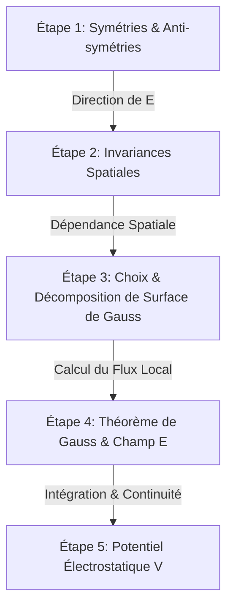

# Guide de Référence Technique & Prompt Système : Évolutions, Intégration LaTeX et Résolution de Bugs (Application Électrostatique Interactive)

Ce document rassemble l'intégralité des évolutions récentes, des spécifications d'intégration mathématique KaTeX, des correctifs de bugs majeurs, ainsi qu'un **Prompt Génératif Maître** permettant de répliquer ou d'améliorer une application de simulation et d'enseignement de la physique (type ElectroSpace).

---

## 1. Vision et Architecture Globale

L'application est une plateforme Web interactive d'apprentissage et de simulation de l'électrostatique (Niveau CPGE / Licence Universitaire). Elle repose sur une dualité d'affichage synchronisée :
- **Canevas 3D / 2D Interactif** (Three.js / HTML Canvas) : Visualisation spatiale des distributions de charges, des surfaces fermées de Gauss, des bases vectorielles locales et des lignes de champ.
- **Compagnon Pédagogique Analytique** : Déroulement pas-à-pas rigoureux des démonstrations vectorielles et intégrales avec rendu mathématique au format LaTeX.

---

## 2. Synthèse des Évolutions Pédagogiques : Le Compagnon de Gauss en 5 Étapes

La refonte pédagogique du Compagnon du Théorème de Gauss (`GaussWizard`) garantit un enchaînement méthodique conforme aux exigences académiques.



### Étape 1 : Analyse de la Direction du Champ $\vec{E}(M)$ (Symétries & Anti-symétries)
- **Principes Physiques** :
  - **Plan de symétrie** $\Pi_S$ de la distribution $\implies \vec{E}(M) \in \Pi_S$.
  - **Plan d'anti-symétrie** $\Pi_A$ de la distribution $\implies \vec{E}(M) \perp \Pi_A$.
  - La direction de $\vec{E}(M)$ est à l'intersection des plans de symétrie.
- **Représentations des Bases Vectorielles** :
  - *Sphérique* $(\vec{e}_r, \vec{e}_\theta, \vec{e}_\phi)$ : $\vec{E}(M) = E(M) \vec{e}_r$.
  - *Cylindrique* $(\vec{e}_r, \vec{e}_\theta, \vec{e}_z)$ : $\vec{E}(M) = E(M) \vec{e}_r$.
  - *Cartésienne / Plane* $(\vec{e}_x, \vec{e}_y, \vec{e}_z)$ : $\vec{E}(M) = E(z) \vec{e}_z$.
- **Rendu Visuel Dual** :
  - Schémas vectoriels 2D SVG intégrés directement dans les cartes explicatives.
  - Représentation 3D dynamique du trièdre de la base locale et des plans de symétrie transparents autour du point d'évaluation $M$.

### Étape 2 : Invariances & Dépendance des Coordonnées
- **Invariance par rotation** autour d'un axe/centre $\implies$ indépendance vis-à-vis des angles ($\theta, \phi$).
- **Invariance par translation** $\implies$ indépendance vis-à-vis de la coordonnée de translation ($z$ ou $x, y$).
- **Résultats** :
  - Sphère : $E(r, \theta, \phi) = E(r)$
  - Cylindre infini : $E(r, \theta, z) = E(r)$
  - Plan infini : $E(x, y, z) = E(|z|)$

### Étape 3 : Choix de la Surface de Gauss ($\Sigma$) & Flux Local
- Sélection d'une surface fermée imaginaire $\Sigma$ sur laquelle :
  1. $E$ est uniforme sur les parties actives ($\vec{E} \parallel d\vec{S}$).
  2. $\vec{E}$ est orthogonal aux surfaces de raccordement ($\vec{E} \perp d\vec{S} \implies \vec{E} \cdot d\vec{S} = 0$).
- **Décomposition** :
  - *Sphère* : $\Phi = \iint E(r) dS = E(r) \cdot (4 \pi r^2)$.
  - *Cylindre* : $\Phi = \Phi_{\text{lat}} + \Phi_{\text{bases}} = E(r) \cdot (2 \pi r h) + 0$.
  - *Plan (Pilulier)* : $\Phi = 2 \cdot E(|z|) \cdot S_{\text{base}} + 0$.

### Étape 4 : Charge Enfermée $Q_{\text{int}}$, Flux et Expression de $\vec{E}$
- Prise en compte rigoureuse du caractère **creux** (surfacique) ou **plein** (volumique) et du régime d'évaluation ($r < R$ vs $r \ge R$).
- Application de $\Phi = \frac{Q_{\text{int}}}{\varepsilon_0} \implies E(r) = \frac{Q_{\text{int}}}{\varepsilon_0 \cdot A_{\text{active}}}$.

### Étape 5 : Potentiel Électrostatique $V(r)$ (Intégration & Continuité)
- **Relation fondamentale** : $E(r) = -\frac{dV}{dr} \implies V(r) = -\int E(r) dr + C$.
- **Raccordement par Continuité** : Égalité des potentiels interne et externe à l'interface $V_{\text{int}}(R) = V_{\text{ext}}(R)$.
- **Fixation de la Référence** :
  - Pour les distributions finies (Sphère) : $V(\infty) = 0 \implies C_{\text{ext}} = 0$.
  - Pour les distributions infinies (Cylindre, Plan) : Référence fixée à la surface $V(R) = 0$ ou $V(0) = 0$.

---

## 3. Guide et Normes d'Intégration de LaTeX (KaTeX)

### Architecture Technique
Afin de garantir un chargement rapide, d'éviter d'alourdir le bundle Vite/React et de prévenir les conflits de dépendances npm :
1. **Chargement via CDN** dans `index.html` :
   ```html
   <link rel="stylesheet" href="https://cdn.jsdelivr.net/npm/katex@0.16.8/dist/katex.min.css">
   <script src="https://cdn.jsdelivr.net/npm/katex@0.16.8/dist/katex.min.js"></script>
   ```
2. **Composants d'Encapsulation React** :
   ```jsx
   function renderKaTeX(math, displayMode = false) {
     if (typeof window !== 'undefined' && window.katex && typeof window.katex.renderToString === 'function') {
       try {
         return window.katex.renderToString(math, { displayMode, throwOnError: false });
       } catch {
         return math;
       }
     }
     return math;
   }

   export function InlineMath({ math }) {
     const html = renderKaTeX(math, false);
     return <span dangerouslySetInnerHTML={{ __html: html }} />;
   }

   export function BlockMath({ math }) {
     const html = renderKaTeX(math, true);
     return <div className="gw-katex-block" dangerouslySetInnerHTML={{ __html: html }} />;
   }

   export function TextWithMath({ text }) {
     if (!text) return null;
     const parts = text.split('$');
     return (
       <span>
         {parts.map((part, index) => 
           index % 2 === 1 ? <InlineMath key={index} math={part} /> : part
         )}
       </span>
     );
   }
   ```

### Règles d'Or et Pièges à Éviter en JSX
1. **Ne JAMAIS écrire de crochet LaTeX brut `\[ ... \]` ou `\( ... \)` dans du texte JSX**. React tente d'analyser ces caractères et génère des erreurs de parsing ou supprime les backslashes.
2. **Toujours doubler les backslashes** dans les chaînes JavaScript :
   - Correct : `math="E(r) = \\frac{Q_{\\text{int}}}{4 \\pi \\varepsilon_0 r^2}"`
   - Incorrect : `math="E(r) = \frac{Q_{\text{int}}}{4 \pi \varepsilon_0 r^2}"`
3. **Formules par Morceaux** (Accolades LaTeX) :
   Utiliser la structure `\begin{cases} ... \end{cases}` pour présenter les formules discontinues :
   ```javascript
   const formula = "E(r) = \\begin{cases} 0 & \\text{si } r < R \\\\ \\frac{k_e Q}{r^2} & \\text{si } r \\ge R \\end{cases}";
   ```
4. **Style CSS Responsive** :
   Les conteneurs de formule bloc doivent impérativement posséder un défilement horizontal en cas de débordement :
   ```css
   .gw-katex-block {
     overflow-x: auto;
     overflow-y: hidden;
     padding: 0.5rem 0;
     max-width: 100%;
   }
   ```

---

## 4. Journal des Bugs Résolus et Bonnes Pratiques de Code

### A. Singularités Mathématiques et Physiques en $r = 0$
- **Problème** : Division par zéro ($1/r^2$ ou $1/r$) provoquant des valeurs `NaN` ou `Infinity` pour le champ électrique ou le potentiel en $r=0$.
- **Solution** :
  - Implémentation d'une valeur de sécurité pour le rayon de calcul : `const rSafe = Math.max(r, 1e-6);`.
  - Prise en compte de la valeur limite exacte du potentiel au centre d'une distribution volumique pleine :
    $$V(0) = \frac{3 k_e Q}{2 R}$$

### B. Stabilisation des Graphiques 2D ($E(r)$ et $V(r)$)
- **Problème** : Rupture du tracé Recharts / Canvas au niveau des discontinuités (ex: passage $r = R$ pour une sphère conductrice/creuse).
- **Solution** :
  - Échantillonnage explicite des points de discontinuité en générant deux points distincts pour le même $r = R$ ($r^-$ et $r^+$) afin de tracer un saut propre sans inclinaison parasite.
  - Calcul dynamique du domaine des ordonnées pour éviter l'écrasement des courbes en présence d'asymptotes.

### C. Gestion des Ressources et Nettoyage Three.js
- **Problème** : Accumulation de contextes WebGL, fuites de mémoire et gestionnaires d'évènements fantômes lors du basculement entre les vues (Gauss, Coulomb, Dipôle).
- **Solution** :
  - Nettoyage systématique dans les retours de `useEffect` :
    ```javascript
    useEffect(() => {
      // Setup Three.js scene/listeners...
      return () => {
        window.removeEventListener('resize', handleResize);
        geometry.dispose();
        material.dispose();
        renderer.dispose();
      };
    }, []);
    ```

### D. Synchronisation d'État Centralisée (Zustand)
- **Problème** : Décalage entre la position du point d'évaluation $M$ déplacé à la souris dans le canevas 3D et les valeurs affichées dans les cartes KaTeX.
- **Solution** : Centralisation de l'état réactif dans le store Zustand avec souscription directe des composants via des sélecteurs fins.

---

## 5. PROMPT MAÎTRE D'INGÉNIERIE IA (À Copier-Coller pour Nouvelle Application)

Ce prompt peut être directement transmis à un agent IA pour développer ou améliorer une application équivalente.

```markdown
Vous êtes un ingénieur logiciel expert en Web3D (Three.js), React, et en modélisation physique/pédagogique de l'électrostatique.

### OBJECTIF
Développer ou améliorer une application web interactive d'apprentissage de l'électrostatique (Compagnon du Théorème de Gauss et Visualisateur de Champ/Potentiel 3D).

### PILES TECHNIQUES
- Core : React (Vite), JavaScript ES6+
- 3D & Graphiques : Three.js, HTML5 Canvas 2D
- Mathématiques : KaTeX (chargé via CDN) avec composants wrappers React (InlineMath, BlockMath)
- État Global : Zustand
- Icônes & Style : Lucide React, Vanilla CSS moderne (Dark Mode, Glassmorphism, animations fluides)

### EXIGENCES PÉDAGOGIQUES OBLIGATOIRES (GAUSS WIZARD IN 5 STEPS)
Vous devez implémenter le Compagnon du Théorème de Gauss sous la forme d'un guide pas-à-pas en 5 étapes :
1. **Analyse des Symétries et Anti-symétries** : Déduire la direction du champ E(M) (intersection des plans de symétrie / orthogonale aux plans d'antisymétrie). Afficher le trièdre de la base locale (sphérique, cylindrique ou cartésienne) en schéma 2D SVG et en vecteur 3D.
2. **Analyse des Invariances** : Déduire l'indépendance des coordonnées par rotation et translation.
3. **Choix et Décomposition de la Surface de Gauss** : Justifier le choix de la surface fermée (sphère, cylindre, pilulier) et décomposer le flux local (E parallel dS vs E perp dS).
4. **Calcul de Q_int, Flux et Champ Électrique E(r)** : Calculer la charge enfermée selon les cas creux/plein et r < R vs r >= R. Déduire l'expression vectorielle de E(r).
5. **Calcul du Potentiel V(r)** : Intégrer E = -dV/dr, appliquer la continuité de V aux interfaces (r = R) et déterminer les constantes d'intégration selon les conditions aux limites.

### DIRECTIVES DE CODE & CONTRÔLE D'ERREURS
- **LaTeX / KaTeX** : 
  - Charger KaTeX via CDN dans index.html.
  - Ne JAMAIS placer de crochets LaTeX bruts `\[ \]` ou `\( \)` directement dans les chaînes JSX textuelles.
  - Doubler systématiquement les backslashes dans les formules JS (ex: `\\frac`, `\\vec{E}`).
  - Formater les systèmes par morceaux avec `\\begin{cases} ... \\end{cases}`.
- **Singularités & Zero-Division** :
  - Protéger tous les calculs en r = 0 avec `Math.max(r, 1e-6)`.
  - Implémenter les formules exactes du potentiel en 0 pour les distributions volumiques.
- **Three.js & Canvas** :
  - Nettoyer impérativement les géométries, matériaux, renderers et écouteurs d'évènements dans les hooks `useEffect`.
  - Ajuster la caméra Three.js dynamiquement lors des changements de distribution.

### ESTHÉTIQUE & DESIGN SYSTEM
- Theme Sombre Chic (Fond `#0f172a`, Cartes Glassmorphism `rgba(30, 41, 59, 0.7)` avec bordures subtiles `rgba(255,255,255,0.1)`).
- Palette de couleurs accentuées pour la physique :
  - Charge Positive / Champ E : Rouge / Orange (`#ef4444`, `#f97316`)
  - Charge Négative / Potentiel V : Bleu / Violet (`#3b82f6`, `#8b5cf6`)
  - Surface de Gauss : Cyan translucide (`#06b6d4`)
  - Vectors de base : Red (e_r), Green (e_theta), Blue (e_phi/e_z).
```
