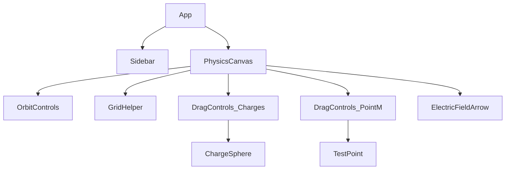

# Document de Conception - Phase 1 : Les fondations

Ce document présente la conception technique détaillée pour la Phase 1 du projet **electro-web**, un bac à sable interactif en 3D pour visualiser les charges électriques ponctuelles et les vecteurs de champ électrique associés.

---

## 1. Modèle de Données & Gestion d'État

Nous utiliserons **Zustand** pour gérer l'état global de l'application de façon fluide et réactive.

### Structure de l'état (Store Zustand)
L'état de la simulation comprendra :
- `charges` : Un tableau d'objets représentants les charges ponctuelles. Chaque charge possède :
  - `id` : Identifiant unique (chaîne de caractères).
  - `q` : Valeur de la charge (en nC ou unités normalisées, positive ou négative).
  - `position` : Un tableau `[x, y, z]` de coordonnées dans l'espace 3D.
- `testPoint` : Position `[x, y, z]` du point de test M.
- `ke` : Constante électrostatique (valeur par défaut : `10` pour de meilleures proportions visuelles).
- `rMin` : Distance de sécurité minimale (valeur par défaut : `0.5`) pour éviter que le champ ne devienne infini lorsque $M$ s'approche d'une charge.
- `eMax` : Limite supérieure de la norme du vecteur $\vec{E}$ affiché (valeur par défaut : `15`) pour que la flèche conserve une taille raisonnable à l'écran.

### Actions du store
- `addCharge(q)` : Ajoute une nouvelle charge ponctuelle avec une valeur $q$ à une position aléatoire.
- `removeCharge(id)` : Supprime la charge correspondante.
- `updateChargePosition(id, position)` : Met à jour les coordonnées d'une charge pendant son glissement (drag).
- `updateChargeQ(id, q)` : Modifie la valeur de charge $q$ depuis la barre latérale.
- `updateTestPoint(position)` : Met à jour la position du point M.
- `clearCharges()` : Supprime toutes les charges de l'espace.

---

## 2. Physique & Calcul du Champ Électrique (`src/physics/coulomb.js`)

Le calcul du champ électrique repose sur la loi de Coulomb et le principe de superposition.

### Équation physique
Le champ électrique $\vec{E}_i$ généré par une charge $q_i$ au point $M$ situé à la distance $r_i$ est :
$$\vec{E}_i = k_e \cdot q_i \cdot \frac{\vec{u}_i}{r_i^2}$$

Où :
- $\vec{r}_i = \vec{M} - \vec{P}_i$ (vecteur reliant la charge au point M)
- $r_i = \|\vec{r}_i\|$ (distance)
- $\vec{u}_i = \frac{\vec{r}_i}{r_i}$ (vecteur unitaire orienté de la charge vers M)

Pour éviter la singularité en $r_i = 0$, nous imposons :
$$r_{effective} = \max(r_i, r_{min})$$

Le champ total $\vec{E}_{total}$ au point $M$ est la somme vectorielle de tous les champs individuels (principe de superposition) :
$$\vec{E}_{total} = \sum_{i} \vec{E}_i$$

---

## 3. Architecture des Composants R3F

Le rendu 3D est structuré sous forme de composants autonomes :

### Détail des Composants 3D

1. **`PhysicsCanvas`** :
   - Encapsule le composant `<Canvas>` de R3F.
   - Configure les lumières (ambiante et directionnelle), la grille (`<gridHelper>`), et les contrôles de caméra (`<OrbitControls>`).
   - Gère le verrouillage/déverrouillage de `OrbitControls` lors des phases de glissement (drag) pour éviter que la caméra ne tourne en même temps qu'on déplace un objet.

2. **`ChargeSphere`** :
   - Rendu 3D : Une sphère rouge si $q > 0$, bleue si $q < 0$.
   - Émet une lueur lumineuse (mesh avec matériau émissif) pour un effet premium et high-tech.
   - Enveloppé dans `<DragControls>` pour permettre son déplacement dans le plan X-Z (ou dans l'espace complet). La position est synchronisée en temps réel dans le store Zustand.

3. **`TestPoint`** :
   - Rendu 3D : Une sphère jaune/blanche brillante représentant le point de test M.
   - Enveloppé dans `<DragControls>` pour le déplacer dans l'espace.

4. **`ElectricFieldArrow`** :
   - Rendu 3D : Utilise l'objet Three.js `<arrowHelper>` pour représenter le vecteur $\vec{E}$.
   - Utilise le hook `useFrame` pour recalculer à chaque frame le vecteur $\vec{E}_{total}$ à la position actuelle de M en fonction de toutes les charges actives.
   - Adapte la direction de la flèche à celle de $\vec{E}_{total}$.
   - Ajuste la longueur de la flèche de manière linéaire avec un seuil de saturation à `eMax` :
     $$\text{longueur\_rendu} = \min(\|\vec{E}_{total}\|, e_{max})$$

---

## 4. Interface Utilisateur 2D (Aesthetics & UX)

L'interface utilisateur 2D viendra se superposer à la scène 3D sous forme de barre latérale moderne (Sidebar) adoptant des codes esthétiques premium :
- **Design Système Sombre** : Fond noir/bleu très sombre (`#0b0f19`) offrant un excellent contraste avec les néons de la 3D.
- **Effets Glassmorphism** : La sidebar utilise un effet de verre dépoli (`backdrop-filter: blur(16px)` et une bordure fine semi-transparente).
- **Contrôleurs interactifs** :
  - Un bouton d'action pour ajouter une charge $+q$ (rouge néon) ou $-q$ (bleu néon).
  - Une liste interactive de toutes les charges présentes avec un curseur (slider) pour modifier leur valeur $q$ et un bouton de suppression individuelle.
  - Affichage numérique stylisé des valeurs du champ :
    - Coordonnées de M : $(x, y, z)$
    - Composantes du champ : $E_x, E_y, E_z$
    - Norme totale du champ : $\|E\|$ (exprimée en N/C ou unités relatives)
  - Bouton pour tout effacer ou charger des configurations par défaut (ex. configuration dipôle).

---

## 5. Plan de Vérification

### Validation Physique
- Placer une charge $q = 1$ à l'origine $(0, 0, 0)$ et le point $M$ à $(2, 0, 0)$. Vérifier que le champ $\vec{E}$ pointe vers $+x$ et a pour norme $10 \times 1 / 4 = 2.5$.
- Placer deux charges identiques de part et d'autre de M et vérifier que le champ s'annule par symétrie.

### Validation Ergonomique
- Le glissement (drag) des charges et du point M doit être fluide à 60 FPS sans blocage ni tremblement.
- La rotation de la caméra (`OrbitControls`) doit se désactiver correctement lors du drag pour éviter les conflits d'interaction.
